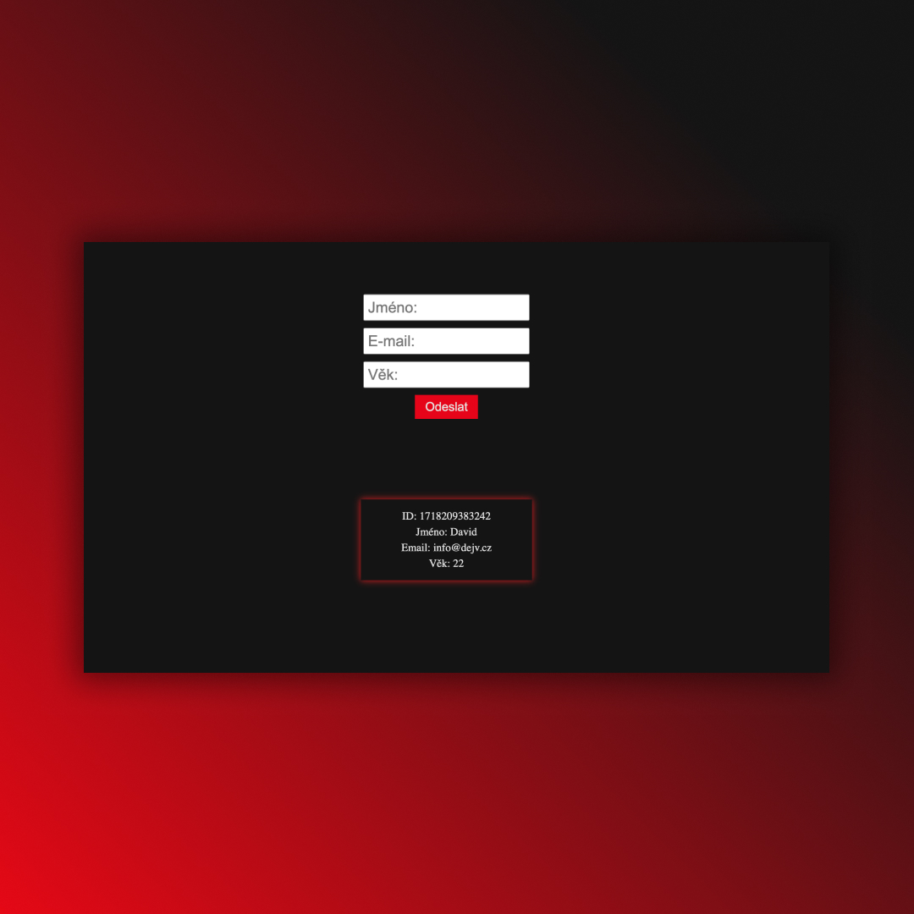

## Advanced Form in React
• Work with form 📝  
• Practicing useState, Spread operator, destructuring, map ✅

## Screenshots 📱

## 💻 Tech Stack

## 🌐 Link
<a href="https://advanced-form-dejvcodes.netlify.app/">Advanced Form in React</a>

## License🔐
[MIT License](LICENSE)